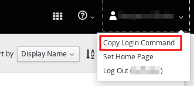
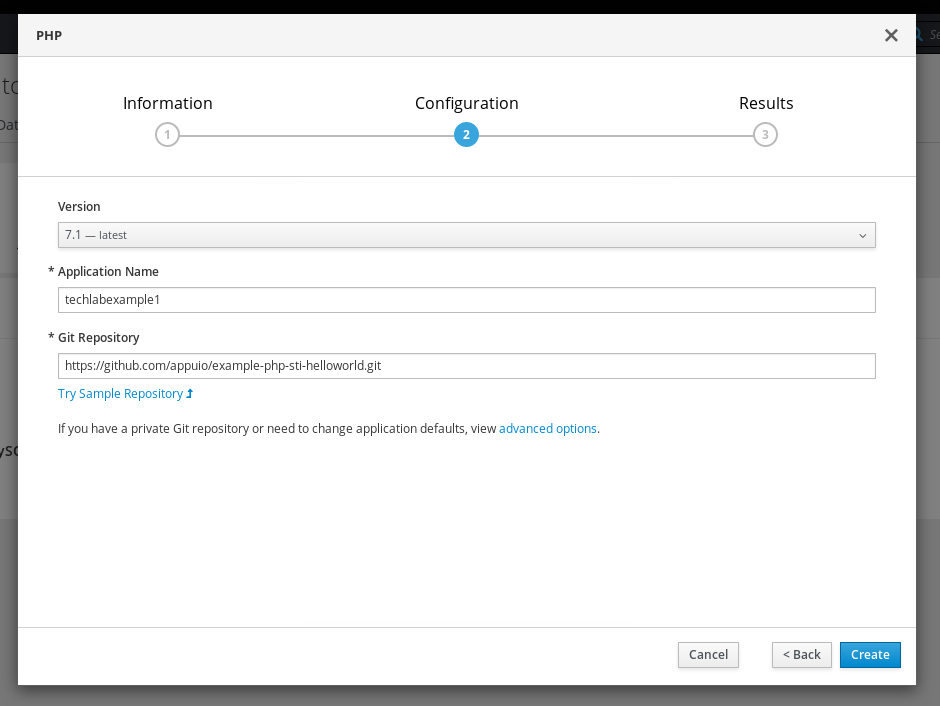

# Openshift
## Vorbereitung
+ [Openshift CLI](https://docs.okd.io/latest/cli_reference/index.html) installieren 
+ [Minishift](https://docs.okd.io/latest/minishift/index.html) installieren 

```
$ oc version

oc v3.11.0+0cbc58b
kubernetes v1.11.0+d4cacc0
features: Basic-Auth GSSAPI Kerberos SPNEGO

Server https://192.168.42.79:8443
kubernetes v1.11.0+d4cacc0
```

```
$ minishift version

minishift v1.33.0+ba29431
```

```
$ minishift start
```
 **Note:** Bitte einmal vor dem mitab testen
 

## Erste Schritte auf der Minishift Plattform

In diesem Lab werden wir gemeinsam das erste Mal mit der Minishift Plattform interagieren, dies sowohl über den oc Client wie auch über die Web Console

### Login

**Note:** Vergewissern Sie sich, dass Sie die Vorbereitung erfolgreich abgeschlossen haben, d.h. erfolgreich auf dem Minishift Webinterface einloggen sowie den `oc` Client installieren konnten.

Der Befehl für das Login mit `oc` kann komfortabel via Webinterface kopiert werden. Dazu oben rechts auf das Account-Symbol und anschliessend auf *Copy Login Command* klicken:



Den Befehl nun in einem Terminal-Fenster einfügen.


### Projekt erstellen

Ein Projekt in OpenShift ist das Top Level Konzept um Ihre Applikationen, Deployments, Builds, Container etc. zu organisieren.

### Aufgabe: 1

Erstellen Sie auf der Minishift Plattform ein neues Projekt.

**Note**: Verwenden Sie für Ihren Projektnamen am besten Ihren Benutzernamen oder sonstigen Identifier, bspw. `[USER]-example1`

> Wie kann ein neues Projekt erstellt werden?

**Tipp** :information_source:
```
$ oc help
```


### Web Console

Die OpenShift Web Console erlaubt es den Benutzern gewisse Tasks direkt via Browser vorzunehmen.


## Aufgabe: 2

1. Gehen Sie in die Übersicht Ihres eben erstellten Projektes. Aktuell ist das Projekt noch leer.

1. Fügen Sie Ihre erste Applikation Ihrem Projekt hinzu. Als Beispielprojekt verwenden wir ein APPUiO Example:

   1. Wechseln Sie zuerst in die Catalog-Ansicht, indem Sie entweder den Button *Add to Project* oben rechts oder direkt *Browse Catalog* in der Projektübersicht wählen
 
   1. Wählen Sie den Reiter *Languages* und anschliessend *PHP* aus
 
   1. Wählen Sie dazu als Version *7.1* aus
 
   1. Geben Sie Ihrem Beispiel einen sprechenden Namen und folgende URL als Repo URL:
   ```
   https://github.com/appuio/example-php-sti-helloworld.git
   ```
   

1. Mit Klick auf *Create* wird die Applikation erstellt

1. Über den Link *Continue to the project overview* kann der Aufbau (bestehend aus Build und anschliessendem Deployment) beobachtet werden

Sie haben nun Ihre erste Applikation mittels sog. **[Source to Image](https://docs.openshift.com/container-platform/3.9/architecture/core_concepts/builds_and_image_streams.html#source-build)** Build auf OpenShift deployed.

**Tipp:** Mit dem folgenden Command können Sie in ein anderes Projekt wechseln:
```
$ oc project [projectname]
```

**Tipp:** Mit den folgenden Befehlen kann das obere Beispiel aus der Kommandozeile erstellt werden:

**Note:** Der `oc new-app`-Befehl benötigt `git`. Falls `git` nicht installiert ist, insb. auf Windows, kann das Tool [hier heruntergeladen](https://git-scm.com/download/win) und installiert werden.

```
$ oc new-app https://github.com/appuio/example-php-sti-helloworld.git --name=appuio-php-sti-example
$ oc expose svc appuio-php-sti-example
```

**Tipp:** Eine ganze App kann mit dem folgenden Befehl gelöscht werden:
```
$ oc delete all --selector app=appname
```
bspw.
```
$ oc delete all --selector app=appuio-php-sti-example
```

---

### Lösung: Aufgabe 1

```
$ oc new-project [USER]-example1
```
---

##Ein Docker Image deployen

In diesem Lab werden wir gemeinsam das erste "pre-built" Docker Image deployen und die OpenShift-Konzepte Pod, Service, DeploymentConfig und ImageStream etwas genauer anschauen.


## Aufgabe: 3

Nachdem wir im vorhin den Source-to-Image Workflow verwendet haben, um eine Applikation auf OpenShift zu deployen, wenden wir uns nun dem Deployen eines pre-built Docker Images von Docker Hub oder einer anderen Docker-Registry zu.

> [Weiterführende Dokumentation](https://docs.openshift.com/container-platform/3.9/dev_guide/application_lifecycle/new_app.html#specifying-an-image)

Als ersten Schritt erstellen wir dafür ein neues Projekt. Ein Projekt ist eine Gruppierung von Ressourcen (Container und Docker Images, Pods, Services, Routen, Konfiguration, Quotas, Limiten und weiteres). Für das Projekt berechtigte User können diese Ressourcen verwalten. Innerhalb eines OpenShift Clusters muss der Name eines Projektes eindeutig sein.

Erstellen Sie daher ein neues Projekt mit dem Namen `[USER]-dockerimage`:

```
$ oc new-project [USER]-dockerimage
```

`oc new-project` wechselt automatisch in das eben neu angelegte Projekt. Mit dem `oc get` Command können Ressourcen von einem bestimmten Typ angezeigt werden.

Verwenden Sie
```
$ oc get project
```
um alle Projekte anzuzeigen, auf die Sie berechtigt sind.

Sobald das neue Projekt erstellt wurde, können wir in OpenShift mit dem folgenden Befehl das Docker Image deployen:

```
$ oc new-app appuio/example-spring-boot
```
Output:
```
--> Found Docker image d790313 (3 weeks old) from Docker Hub for "appuio/example-spring-boot"

    APPUiO Spring Boot App
    ----------------------
    Example Spring Boot App

    Tags: builder, springboot

    * An image stream will be created as "example-spring-boot:latest" that will track this image
    * This image will be deployed in deployment config "example-spring-boot"
    * Port 8080/tcp will be load balanced by service "example-spring-boot"
      * Other containers can access this service through the hostname "example-spring-boot"

--> Creating resources with label app=example-spring-boot ...
    imagestream "example-spring-boot" created
    deploymentconfig "example-spring-boot" created
    service "example-spring-boot" created
--> Success
    Run 'oc status' to view your app.

```

Für unser Lab verwenden wir ein APPUiO-Beispiel (Java Spring Boot Applikation):
- Docker Hub: https://hub.docker.com/r/appuio/example-spring-boot/
- GitHub (Source): https://github.com/appuio/example-spring-boot-helloworld

OpenShift legt die nötigen Ressourcen an, lädt das Docker Image in diesem Fall von Docker Hub herunter und deployt anschliessend den ensprechenden Pod.

**Tipp:** Verwenden Sie `oc status` um sich einen Überblick über das Projekt zu verschaffen.

Oder verwenden Sie den `oc get` Befehl mit dem `-w` Parameter, um fortlaufend Änderungen an den Ressourcen des Typs Pod anzuzeigen (abbrechen mit ctrl+c):
```
$ oc get pods -w
```

Je nach Internetverbindung oder abhängig davon, ob das Image auf Ihrem OpenShift Node bereits heruntergeladen wurde, kann das eine Weile dauern. Schauen Sie sich doch in der Web Console den aktuellen Status des Deployments an:

1. Loggen Sie sich in der Web Console ein
2. Wählen Sie Ihr Projekt `[USER]-dockerimage` aus
3. Klicken Sie auf Applications
4. Wählen Sie Pods aus


**Tipp** Um Ihre eigenen Docker Images für OpenShift zu erstellen, sollten Sie die folgenden Best Practices befolgen: https://docs.openshift.com/container-platform/3.9/creating_images/guidelines.html


### Betrachten der erstellten Ressourcen

Als wir `oc new-app appuio/example-spring-boot` vorhin ausführten, hat OpenShift im Hintergrund einige Ressourcen für uns angelegt. Die werden dafür benötigt, dieses Docker Image zu deployen:

- [Service](https://docs.openshift.com/container-platform/3.9/architecture/core_concepts/pods_and_services.html#services)
- [ImageStream](https://docs.openshift.com/container-platform/3.9/architecture/core_concepts/builds_and_image_streams.html#image-streams)
- [DeploymentConfig](https://docs.openshift.com/container-platform/3.9/dev_guide/deployments/how_deployments_work.html)

#### Service

[Services](https://docs.openshift.com/container-platform/3.9/architecture/core_concepts/pods_and_services.html#services) dienen innerhalb OpenShift als Abstraktionslayer, Einstiegspunkt und Proxy/Loadbalancer auf die dahinterliegenden Pods. Der Service ermöglicht es, innerhalb OpenShift eine Gruppe von Pods des gleichen Typs zu finden und anzusprechen.

Als Beispiel: Wenn eine Applikationsinstanz unseres Beispiels die Last nicht mehr alleine verarbeiten kann, können wir die Applikation bspw. auf drei Pods hochskalieren. OpenShift mapt diese als Endpoints automatisch zum Service. Sobald die Pods bereit sind, werden Requests automatisch auf alle drei Pods verteilt.

**Note:** Die Applikation kann aktuell von aussen noch nicht erreicht werden, der Service ist ein OpenShift-internes Konzept. Im folgenden Lab werden wir die Applikation öffentlich verfügbar machen.

Nun schauen wir uns unseren Service mal etwas genauer an:

```
$ oc get services
```

```
NAME                  CLUSTER-IP      EXTERNAL-IP   PORT(S)    AGE
example-spring-boot   172.30.124.20   <none>        8080/TCP   2m
```

Wie Sie am Output sehen, ist unser Service (example-spring-boot) über eine IP und Port erreichbar (172.30.124.20:8080) **Note:** Ihre IP kann unterschiedlich sein.

**Note:** Service IPs bleiben während ihrer Lebensdauer immer gleich.

Mit dem folgenden Befehl können Sie zusätzliche Informationen über den Service auslesen:
```
$ oc get service example-spring-boot -o json
```

```
{
    "kind": "Service",
    "apiVersion": "v1",
    "metadata": {
        "name": "example-spring-boot",
        "namespace": "techlab",
        "selfLink": "/api/v1/namespaces/techlab/services/example-spring-boot",
        "uid": "b32d0197-347e-11e6-a2cd-525400f6ccbc",
        "resourceVersion": "17247237",
        "creationTimestamp": "2016-06-17T11:29:05Z",
        "labels": {
            "app": "example-spring-boot"
        },
        "annotations": {
            "openshift.io/generated-by": "OpenShiftNewApp"
        }
    },
    "spec": {
        "ports": [
            {
                "name": "8080-tcp",
                "protocol": "TCP",
                "port": 8080,
                "targetPort": 8080
            }
        ],
        "selector": {
            "app": "example-spring-boot",
            "deploymentconfig": "example-spring-boot"
        },
        "portalIP": "172.30.124.20",
        "clusterIP": "172.30.124.20",
        "type": "ClusterIP",
        "sessionAffinity": "None"
    },
    "status": {
        "loadBalancer": {}
    }
}
```

Mit dem entsprechenden Befehl können Sie auch die Details zu einem Pod anzeigen:
```
$ oc get pod example-spring-boot-3-nwzku -o json
```

**Note:** Zuerst den pod Namen aus Ihrem Projekt abfragen (`oc get pods`) und im oberen Befehl ersetzen.

Über den `selector` Bereich im Service wird definiert, welche Pods (`labels`) als Endpoints dienen. Dazu können die entsprechenden Konfigurationen von Service und Pod zusammen betrachtet werden.

Service (`oc get service <Service Name>`):
```
...
"selector": {
    "app": "example-spring-boot",
    "deploymentconfig": "example-spring-boot"
},

...
```

Pod (`oc get pod <Pod Name>`):
```
...
"labels": {
    "app": "example-spring-boot",
    "deployment": "example-spring-boot-1",
    "deploymentconfig": "example-spring-boot"
},
...
```

Diese Verknüpfung ist besser mittels `oc describe` Befehl zu sehen:
```
$ oc describe service example-spring-boot
```

```
Name:			example-spring-boot
Namespace:		techlab
Labels:			app=example-spring-boot
Selector:		app=example-spring-boot,deploymentconfig=example-spring-boot
Type:			ClusterIP
IP:				172.30.124.20
Port:			8080-tcp	8080/TCP
Endpoints:		10.1.3.20:8080
Session Affinity:	None
No events.
```

Unter Endpoints finden Sie nun den aktuell laufenden Pod.


### ImageStream
[ImageStreams](https://docs.openshift.com/container-platform/3.9/architecture/core_concepts/builds_and_image_streams.html#image-streams) werden dafür verwendet, automatische Tasks auszuführen wie bspw. ein Deployment zu aktualisieren, wenn eine neue Version des Images oder des Basisimages verfügbar ist.

Builds und Deployments können Image Streams beobachten und auf Änderungen entsprechend reagieren. In unserem Beispiel wird der Image Stream dafür verwendet, ein Deployment zu triggern, sobald etwas am Image geändert hat.

Mit dem folgenden Befehl können Sie zusätzliche Informationen über den Image Stream auslesen:
```
$ oc get imagestream example-spring-boot -o json
```

### DeploymentConfig

In der [DeploymentConfig](https://docs.openshift.com/container-platform/3.9/dev_guide/deployments/how_deployments_work.html) werden folgende Punkte definiert:

- Update Strategy: wie werden Applikationsupdates ausgeführt, wie erfolgt das Austauschen der Container?
- Triggers: Welche Triggers führen zu einem Deployment? In unserem Beispiel ImageChange
- Container
  - Welches Image soll deployed werden?
  - Environment Configuration für die Pods
  - ImagePullPolicy
- Replicas, Anzahl der Pods, die deployt werden sollen


Mit dem folgenden Befehl können zusätzliche Informationen zur DeploymentConfig ausgelesen werden:
```
$ oc get deploymentConfig example-spring-boot -o json
```

Im Gegensatz zur DeploymentConfig, mit welcher man OpenShift sagt, wie eine Applikation deployt werden soll, definiert man mit dem ReplicationController, wie die Applikation während der Laufzeit aussehen soll (bspw. dass immer 3 Replicas laufen sollen).

**Tipp:** für jeden Resource Type gibt es auch eine Kurzform. So können Sie bspw. `oc get deploymentconfig` auch einfach als `oc get dc` schreiben.

---

## Zusatzaufgabe für Schnelle ;-)

Schauen Sie sich die erstellten Ressourcen mit `oc get [ResourceType] [Name] -o json` und `oc describe [ResourceType] [Name]` aus dem ersten Projekt `[USER]-example1` an.

---
